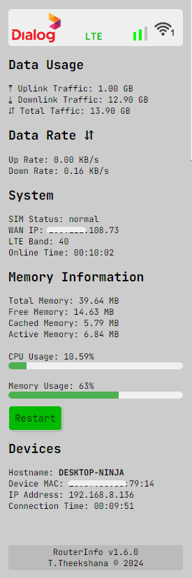

# RouterInfo
### Overview
This Chrome extension provides a comprehensive dashboard for **ZLT home broadband**.

### Features
- CPU/Memory Usage: View real-time CPU and memory usage of your broadband router.
- Up/Down Speed: Monitor the current upload and download speeds.
- Up/Down Traffic: Keep track of the total uploaded and downloaded data.
- Connected Devices: See a list of all devices currently connected to your network.
- Router Control: Easily restart your router directly from the dashboard.

